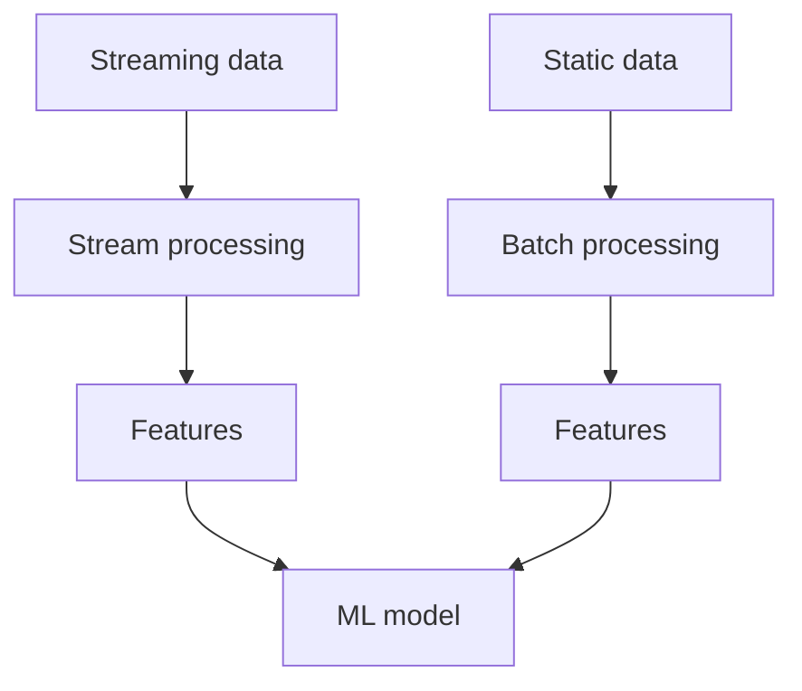
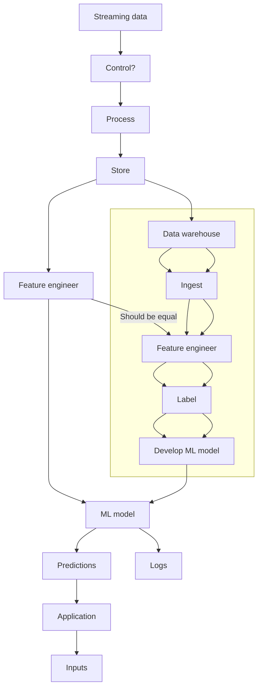

# Designing Machine Learning Systems by Chip Huyen

## Checklist

### Ch2 Life cycle: Project Scoping

- Understand the business objectives
- Identify business metrics

### Four characteristics of ML systems

- Reliability
- Scalability
- Maintainability
- Adaptability

### ML Development Cycle

1. Project Scoping
2. Data Engineering
3. ML model development
4. Deployment
5. Monitoring and continuous learning
6. Business Analysis

### 1. Project Scoping

- Is the problem you are trying to solve even a ML problem? Can it be framed as a ML problem?
- Identify goals and objectives
- Classification or regression?
- Identify stakeholders
- Estimate Resources

### Ch3 Life cycle: Data Engineering

#### 2. Data Engineering

- Understand the data
  - Check for skewed distribution
- Pick the right data model for your needs: Relational model, document model, graph database etc.
- Decide on structured vs. unstructured data

### Ch4 Life cycle: Data Engineering cjjjjjjjjjjjkollection

#### Decide on sampling method

Common choices:

- Non-probability sampling - should not use unless you have to, high probability of selection bias
  - Convenience sampling
  - Snowball sampling
  - Judgment sampling
  - Quota sampling

- Random sampling
  - Simple random sampling
  - Stratified random sampling
  - Weighted sampling
  - Reservoir sampling
  - Importance sampling

#### Labeling methods

- Hand labels  
- Natural labels
- Lack of labels
  - Weak supervision
  - Semi-supervision
  - Transfer learning
  - Active learning

#### Class Imbalances

- Data-distribution
  - Evaluate the ROC curve for the positive class
  - Evaluate the precision-recall curve for the negative class
- Data level
  - Resampling - oversampling, undersampling
- Algorithmic level
  - Tuning the loss function
    - Cost-sensitive learning
    - Class-balanced loss
    - Focal loss

#### Data augmentation

- Label-preserving transformations
- Data synthesis

### Ch5 Life cycle: Model Development

#### Feature Engineering

- Handle missing values
- Identify the type of missing values
  - Missing completely at random (MCAR)
  - Missing at random (MAR)
  - Missing not at random (MNAR)
- Dealing with missing values
  - Remove the rows
  - Remove the columns
  - Impute the missing values
    - Use a default, ex. ""
    - Use mean, median, mode
- Feature Scaling
  - Check for skewed distribution
    - Apply log transformation
  - Verify did not introduce data leakage by scaling
- Encoding Categorical Features
  - Check whether categories have changed over time
  - Check whether categories are added
    - If so use the "hashing trick"
- Feature Crossing: combine features to create new features
- Data leakage
  - Check for the following:
    - Do you understand how the data was generated?
    - If the data is time-correlated, was it split by time?
    - Scaling before splitting
    - Remove duplicates before splitting
    - Group leakage
  - Detecting data leakage
    - Measure the predictive power of each feature against a label
    - Determine how many features are correlated with the label
      - Do an ablation study
    - If new feature improves the model then check that there is not data leakage
- Measure feature importance
  - SHAP
- Feature Generalization
  - Generally want to look at two things:
    - Feature coverage
    - Distribution of feature values
      - Is it in both your training and test sets?

### Ch6 Life cycle: Model Development

### Model Development and Offline Evaluation

Model Evaluation

- common models for text classification include naive Bayes, logistic regression, recurrent neural networks, and transformer-based models such as BERT, GPT, and their variants.

- fraudulent transactions are abnormalities that you want to detect—and common algorithms for this problem are many, including k-nearest neighbors, isolation forest, clustering, and neural networks.

- it’s important to consider not only the model’s performance, measured by metrics such as accuracy, F1 score, and log loss, but also its other properties, such as how much data, compute, and time it needs to train, what’s its inference latency, and interpretability.

#### 6 tips for model selection

1. Avoid the state-of-the-art trap
2. Start with the simplest model
3. Avoid human biases in selecting models
4. Evaluate good performance now vs good performance later
   - Use learning curves to evaluate how your model might perform with more data
5. Evaluate trade-offs

### Ch7 Life cycle: Deployment

### Deployment

deployment - leaving the dev env, prod can be a spectrum

Myths:

1) Only deploying one model at a time

2) Model performance remains constant

    - models are prone to data distribution shifts

3) Won't need to update the modes much

4) Don't need to worry about scale

#### Online vs. Batch

online - synchronous with requests, typically done through APIs and on demand ex. translation, image classification, etc.

batch -  asynchronous with requests, typically served from a data store (SQL db), periodic or triggered, ex. hourly recommendation updates

Uses for batch prediction:

1. performant since pre-computed

2. need a lot of predictions but dont need the results immediately

Problems of batch prediction

1. less responsive to real time changes in data

2. need to know what predictions to generate in advance

Requirements for fast online prediction:

1. near real time response times  

2. a pipeline that can extract streaming features and input them into a model, near real time

3. model that can generate predictions in real time

Modern approach to unify batch and streaming:

anti-pattern: having two different pipelines for batch and streaming that feed into the same model

Online prediction

Technologies like Apache Flink can be used to unify batch and stream processing.

#### Model Compression - making a model smaller

If the model takes too long to serve predictions then can try:

1. make inference faster

2. make the model smaller

3. hardware

Common compression techniques:

1. low-rank factiorization

- compact convolutional filters - over-parameterized convolutional filters are replaces with compact blocks

- only applies to convolutional filters

- requires deep architectural knowledge

2. knowledge distillation - ex. DistilBERT

- student trained from teacher

3. pruning

4. quantization

### Monitoring and continual learning

### Business Analysis
